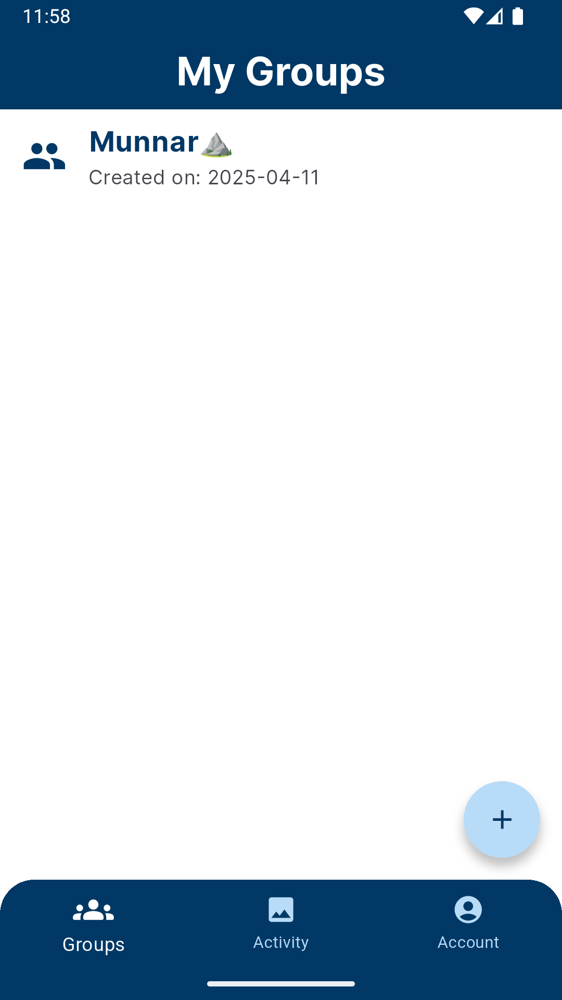
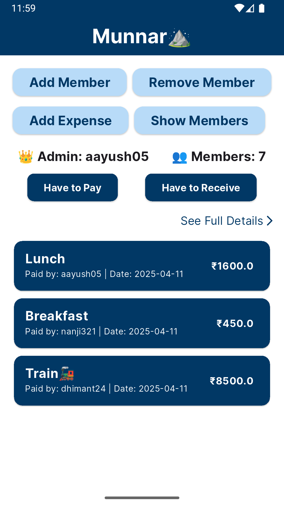
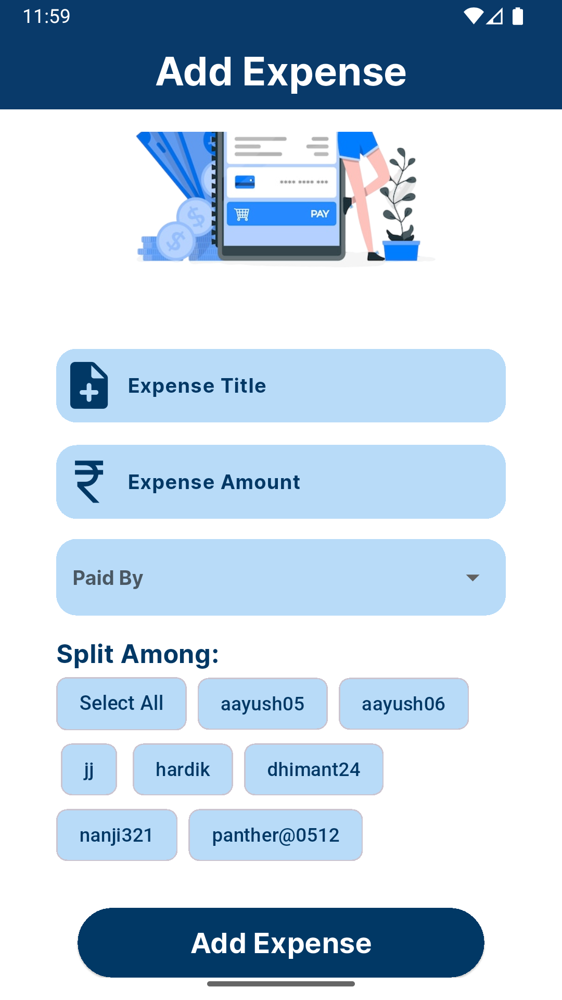
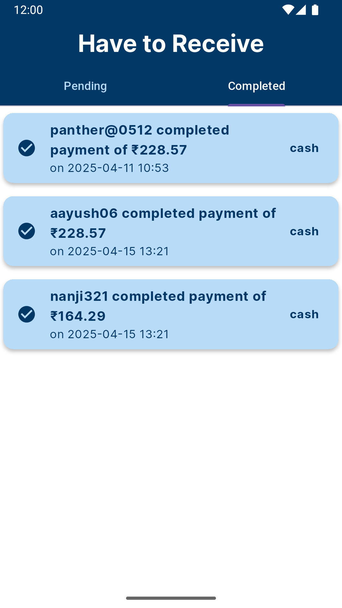
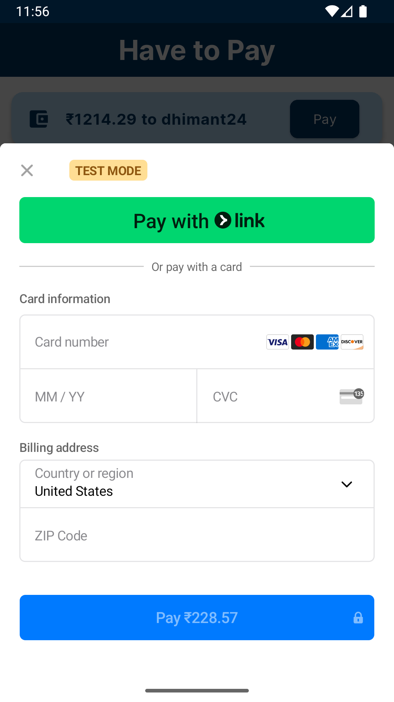

# 💸 Splitzy – Smart Expense Splitter App

**Splitzy** is a Flutter app that helps users split expenses within groups easily and clearly. Whether it's a trip, a party, or regular shared costs — Splitzy makes expense sharing smooth and transparent.

---

## 🚀 Features

- 👥 Create and manage groups
- ➕ Add expenses with title, amount, payer, and selected members
- 📊 Automatically calculate who has to pay or receive
- 💵 Settle balances via **Cash** or **Online (UPI)**
- 🧾 View and edit expense history
- 📋 Activity log showing group events (added members, expenses)
- 👤 User account page with logout

---

## 🛠 Technologies Used

- **Flutter** – UI framework
- **Dart** – Programming language
- **Firebase Authentication** – For sign-up/sign-in and forgot password
- **Cloud Firestore** – For storing users, groups, and expenses
- **setState** – For state management

---

## 📸 Screenshots

> _Here are some screenshots of the app in action:_

## 🧪 How to Run

1. **Clone this repo:**

   git clone https://github.com/aayush052003/splitzy.git
   
   cd splitzy
   
3. **Install packages:**

   flutter pub get
   
4. **Run the app:**

   flutter run

## 🙌 Contribution

Feel free to fork the repo, open issues, or submit pull requests to make Splitzy even better!

---

## 👨‍💻 Author

Made with ❤️ by [@aayush052003](https://github.com/aayush052003)
